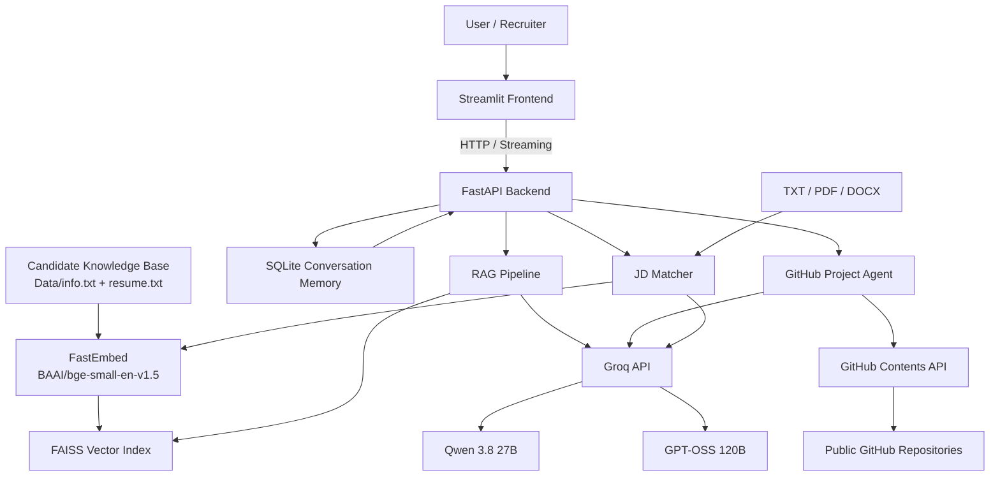

# HireMeAI 🤖

> An AI-powered portfolio assistant that lets recruiters, interviewers, and visitors **chat with a candidate's profile, explore projects, and evaluate a resume against a job description**.

<p align="center">
  <a href="https://hiremeai-production-408a.up.railway.app/docs">Backend API / Swagger Docs</a>
  •
  <a href="https://hiremeai-production-408a.up.railway.app">Backend</a>
  •
  <a href="https://github.com/Abhigya27/HireMeAI">GitHub Repository</a>
</p>

---

## 🚀 What is HireMeAI?

HireMeAI is a personal AI hiring/portfolio assistant built around two main experiences:

### 💬 1. Conversational Portfolio Assistant

Visitors can ask questions about the candidate's:

- background
- technical skills
- experience
- projects
- education
- technologies used
- project architecture and implementation

The assistant uses **history-aware Retrieval-Augmented Generation (RAG)** so follow-up questions can refer to previous messages naturally.

For example:

> **User:** What projects have you built?

> **Assistant:** ...lists the projects.

> **User:** Tell me more about the second one.

The backend first rewrites the follow-up into a standalone query using the conversation history, then performs retrieval against the knowledge base.

### 📄 2. Job Description Matcher

A recruiter can upload a job description in:

- `.txt`
- `.pdf`
- `.docx`

HireMeAI extracts the job description, compares it with the candidate's resume, and produces a structured analysis containing:

- topic-by-topic verdicts
- transferable/equivalent skills
- genuine skill gaps
- gap severity
- overall fit verdict
- a `0–100` fit score

The matcher intentionally distinguishes **must-have requirements** from **nice-to-have requirements** instead of treating every line of a job posting as equally important.

---

## 🏗️ Architecture



### High-level design

The application is split into two independently running layers:

**Frontend**
- Streamlit
- User interface
- Chat experience
- JD file upload
- Streaming responses
- Resume download and social/profile links

**Backend**
- FastAPI
- RAG pipeline
- LLM interaction
- Conversation memory
- GitHub project research agent
- JD extraction and matching
- Rate limiting
- API endpoints

The frontend communicates with the backend over HTTP, keeping UI and application logic separated.

---

# 🧠 Core AI Architecture

## 1. Retrieval-Augmented Generation

The candidate profile is stored as text in the `Data/` directory.

The RAG pipeline uses:

- **FastEmbed**
- **BAAI/bge-small-en-v1.5**
- **384-dimensional embeddings**
- **FAISS**
- cosine-style semantic retrieval through vector representations / nearest-neighbour search
- Groq-hosted LLM generation

The source text is split using a structure-aware chunking strategy:

1. Split on paragraph boundaries.
2. Keep complete paragraphs when they fit.
3. Split larger paragraphs on sentence boundaries.
4. Apply a small overlap between chunks.

This preserves project descriptions and other coherent sections instead of blindly cutting text at fixed character offsets.

The resulting embeddings are stored in a local FAISS index.

### Automatic index refresh

The system stores a SHA-256 fingerprint of `Data/info.txt`.

When the source changes, HireMeAI detects the fingerprint mismatch and rebuilds the FAISS index automatically. This prevents stale retrieval results after profile/project information is updated.

The FastAPI application also warms the embedding model and FAISS index during startup so the first user request does not have to perform the entire initialization path.

---

## 2. History-Aware Chat

Conversation state is stored in **SQLite**.

Two pieces of information are persisted:

```text
turns
├── session_id
├── role
├── content
└── created_at

session_state
├── session_id
└── active_project
```

The active-project state is particularly useful for project conversations.

Example:

```text
User: Tell me about HireMeAI.
Assistant: ...

User: Yes, go deeper.
```

Instead of treating `"Yes, go deeper"` as an unrelated search query, the system can use the active project stored in SQLite to route it as a continuation of the HireMeAI discussion.

The system also uses an LLM-powered query condensation step to turn contextual follow-ups into standalone retrieval queries.

---

# 🧑‍💻 GitHub Project Agent

HireMeAI goes beyond a static resume chatbot.

When a visitor asks for implementation-level information about a project, the backend can switch to a **GitHub project research agent**.

Examples:

```text
How does the HireMeAI backend work?
Explain the architecture of HireMeAI.
How is authentication implemented?
How does the RAG pipeline work?
What does the backend/main.py file do?
How is the project deployed?
```

The agent:

1. Identifies the configured project.
2. Uses the GitHub project registry to resolve the repository.
3. Retrieves the repository file tree.
4. Uses an LLM tool-calling loop to decide which source files are relevant.
5. Reads those files through the GitHub Contents API.
6. Synthesizes an answer from the code it actually inspected.
7. Returns the answer together with GitHub source links.

This makes technical project explanations **grounded in the repository implementation**, instead of relying only on a manually written project summary.

The agent also has a configurable maximum number of research rounds and a per-file character cap to keep tool-driven investigation bounded.

---

# 📄 Job Description Matching Pipeline

The `/match` API accepts a job description upload.

Supported formats:

```text
.txt
.pdf
.docx
```

### Extraction layer

- TXT → UTF-8 decoding
- PDF → `pypdf`
- DOCX → `python-docx`

### Matching pipeline

```text
Job Description
      │
      ▼
File Text Extraction
      │
      ▼
Resume + JD
      │
      ├──────────────► Embedding Similarity Baseline
      │
      ▼
LLM Comparison
      │
      ├── Must-have requirements
      ├── Nice-to-have requirements
      ├── Topic verdicts
      ├── Transferable skills
      ├── Genuine gaps
      ├── Final verdict
      └── Fit score
```

The system also uses an embedding-based similarity calculation as part of the matching workflow, while the final structured assessment is generated by the dedicated matching LLM.

The result is returned as structured JSON using a small streaming wire-format marker between the backend and Streamlit frontend.

---

# ⚡ Streaming Responses

LLM responses are streamed instead of waiting for the complete generation.

The backend uses FastAPI's `StreamingResponse`, while the frontend consumes the response incrementally.

This is used for:

- normal portfolio chat
- GitHub project overviews
- GitHub deep dives
- JD matching analysis

This makes the application feel much more responsive during generation.

---

# 🧰 Tech Stack

## Frontend

| Technology | Purpose |
|---|---|
| **Streamlit** | Interactive web UI |
| **HTTPX** | Backend HTTP communication |
| **python-dotenv** | Environment configuration |

## Backend

| Technology | Purpose |
|---|---|
| **FastAPI** | REST API and application server |
| **Pydantic** | Request validation |
| **SlowAPI** | Per-IP rate limiting |
| **SQLite** | Conversation/session persistence |
| **HTTPX** | External API requests |

## AI / RAG

| Technology | Purpose |
|---|---|
| **Groq API** | LLM inference |
| **Qwen 3.8 27B** | Main conversational / routing / project-agent model |
| **GPT-OSS 120B** | Job description matching |
| **FastEmbed** | Local embedding generation |
| **BAAI/bge-small-en-v1.5** | Embedding model |
| **FAISS** | Vector similarity search |
| **NumPy** | Vector operations |

## Document Processing

| Technology | Purpose |
|---|---|
| **pypdf** | PDF text extraction |
| **python-docx** | DOCX text extraction |

## External Integration

| Technology | Purpose |
|---|---|
| **GitHub Contents API** | Repository README, file, and tree retrieval |

## Deployment

The deployed backend is currently hosted on **Railway**.

---

# 📂 Project Structure

```text
HireMeAI/
│
├── backend/
│   ├── faiss_store/
│   │   ├── index.faiss
│   │   ├── chunk_mapping.pkl
│   │   └── info_source.sha256
│   │
│   ├── ats.py
│   ├── client.py
│   ├── config.py
│   ├── github_client.py
│   ├── main.py
│   ├── memory.py
│   ├── project_agent.py
│   ├── rag.py
│   ├── memory.db
│   └── requirements.txt
│
├── Data/
│   ├── abhigya.pdf
│   ├── info.txt
│   └── resume.txt
│
├── frontend/
│   ├── app.py
│   └── requirements.txt
│
├── .env
├── .gitignore
├── .python-version
├── pyproject.toml
└── README.md
```

### Important files

**`backend/main.py`**  
FastAPI application, endpoints, request validation, streaming, rate limiting, and routing between RAG, project-agent, and ATS workflows.

**`backend/rag.py`**  
Embedding, chunking, FAISS index creation/loading, retrieval, relevance gating, and answer-prompt construction.

**`backend/memory.py`**  
SQLite-backed conversation history, active project state, and follow-up query condensation.

**`backend/project_agent.py`**  
Project routing, GitHub repository selection, tool-calling research loop, and technical project answers.

**`backend/github_client.py`**  
GitHub API integration for README retrieval, file retrieval, repository tree inspection, and source URLs.

**`backend/ats.py`**  
Job description extraction, embedding similarity, structured comparison prompting, JSON extraction/repair, and streaming match results.

**`backend/client.py`**  
Low-level Groq client wrapper supporting normal completions, streaming completions, and tool-calling workflows.

**`backend/config.py`**  
Central configuration for model names, embedding settings, chunking, token limits, repository registry, and request limits.

**`frontend/app.py`**  
Streamlit interface, chat UI, streaming display, JD upload flow, resume download, and profile links.

---

# 🔌 API Endpoints

| Method | Endpoint | Purpose |
|---|---|---|
| `POST` | `/chat` | History-aware portfolio chat |
| `POST` | `/chat/clear` | Clear a session's conversation |
| `POST` | `/match` | Upload and evaluate a job description |
| `GET` | `/health` | Health check |
| `GET` | `/docs` | Interactive Swagger/OpenAPI documentation |

### Example `/chat` request

```json
{
  "session_id": "unique-session-id",
  "query": "How does your RAG pipeline work?"
}
```

The response is streamed incrementally.

---

# 🔐 Rate Limiting & Request Controls

HireMeAI includes server-side protection using SlowAPI.

Current limits are configured separately for chat and job matching:

```text
Chat
15 requests / minute
100 requests / hour

JD Matching
5 requests / minute
20 requests / hour
```

Additional request controls include:

- maximum chat query length
- maximum upload size
- file-type validation
- empty-document validation
- bounded GitHub agent research rounds
- bounded file content sent to the agent

This is particularly useful for a public portfolio application where expensive LLM operations should not be left completely unrestricted.

---

# 🔄 Request Flow

## Chat

```text
Streamlit
   │
   ▼
POST /chat
   │
   ├── Project query?
   │      ├── Overview → project profile / README
   │      └── Deep dive → GitHub file research agent
   │
   └── Normal profile query
          │
          ▼
      Condense follow-up
          │
          ▼
      Embed query
          │
          ▼
      FAISS retrieval
          │
          ▼
      Build context + history
          │
          ▼
      Groq / Qwen
          │
          ▼
      StreamingResponse
          │
          ▼
      Streamlit chat UI
```

## Job Description Matching

```text
Streamlit upload
      │
      ▼
POST /match
      │
      ▼
Extract TXT / PDF / DOCX
      │
      ▼
Load resume text
      │
      ▼
Embedding similarity
      │
      ▼
Matching LLM
      │
      ▼
Structured JSON
      │
      ▼
Streamlit result UI
```

---

# 🧪 Design Decisions

### Why FAISS?

The project is designed as a lightweight personal portfolio application, so a local vector index is sufficient. FAISS avoids the operational overhead of running a separate hosted vector database.

### Why SQLite?

Conversation memory is small and session-oriented. SQLite provides persistent storage without requiring a separate database server.

### Why direct Groq API calls?

The application intentionally keeps the AI layer lightweight and explicit. It uses direct Groq SDK calls for streaming, completion, and tool calling instead of introducing an additional orchestration framework.

### Why a separate GitHub agent?

Resume/profile RAG and source-code exploration are different retrieval problems.

- Resume RAG answers questions from curated profile information.
- The GitHub agent answers implementation questions from the actual repository.

Separating the two keeps each path targeted and makes project deep-dives more trustworthy.

---

# 🌐 Live Links

### Application / API

**Swagger Docs:**  
https://hiremeai-production-408a.up.railway.app/docs

**Backend:**  
https://hiremeai-production-408a.up.railway.app

### Source Code

**GitHub:**  
https://github.com/Abhigya27/HireMeAI

---

# ⚙️ Environment Variables

The backend expects environment configuration through `.env` / environment variables.

A typical deployment requires:

```env
GROQ_API_KEY=your_groq_api_key
GITHUB_TOKEN=optional_github_token
```

`GITHUB_TOKEN` is optional for public repositories. An authenticated GitHub token can increase the API rate limit.

Never commit real API keys or tokens to the repository.

---

# ▶️ Local Development

## 1. Clone

```bash
git clone https://github.com/Abhigya27/HireMeAI.git
cd HireMeAI
```

## 2. Configure environment

Create `.env`:

```env
GROQ_API_KEY=your_groq_api_key
GITHUB_TOKEN=your_optional_github_token
```

## 3. Start the backend

From the project root:

```bash
uvicorn backend.main:app --reload
```

The API will be available at:

```text
http://127.0.0.1:8000
```

Swagger:

```text
http://127.0.0.1:8000/docs
```

## 4. Start the frontend

```bash
streamlit run frontend/app.py
```

Make sure the frontend's backend URL points to the running FastAPI server.

---

# 📌 Current Project Characteristics

HireMeAI is designed as a **portfolio-first AI application**, rather than a generic chatbot.

Its main engineering characteristics are:

- FastAPI + Streamlit separation
- Retrieval-Augmented Generation
- local FAISS vector search
- local embedding generation with FastEmbed
- history-aware conversation
- persistent SQLite memory
- LLM-powered query condensation
- GitHub repository inspection through tool calling
- streaming LLM responses
- structured job-description matching
- PDF / DOCX / TXT ingestion
- API rate limiting
- automatic FAISS cache invalidation using source fingerprints
- deployment-ready environment configuration

---

## 📈 Possible Future Enhancements

Potential next steps include:

- authentication and user accounts
- PostgreSQL for production persistence
- Redis-backed distributed rate limiting
- background indexing jobs
- stronger observability / tracing
- automated evaluation datasets for RAG quality
- recruiter-specific analytics
- multi-resume support
- semantic skill taxonomy / normalization
- containerized deployment
- CI/CD with automated tests

---

## 👨‍💻 Author

**Abhigya Narain**

AI Engineer / Software Engineering Candidate

- GitHub: https://github.com/Abhigya27
- LinkedIn: www.linkedin.com/in/abhigya-narain-11643b2b5
- X: https://x.com/AbhigyaNarain
- LeetCode: https://leetcode.com/u/abhigya_27/

---

## ⭐ Why HireMeAI?

HireMeAI combines several practical AI engineering patterns into one deployable application:

> **RAG + conversational memory + LLM routing + tool calling + GitHub code research + document processing + structured LLM output + streaming + API protection**

Rather than presenting a static portfolio page, it turns the portfolio itself into an interactive AI system.
